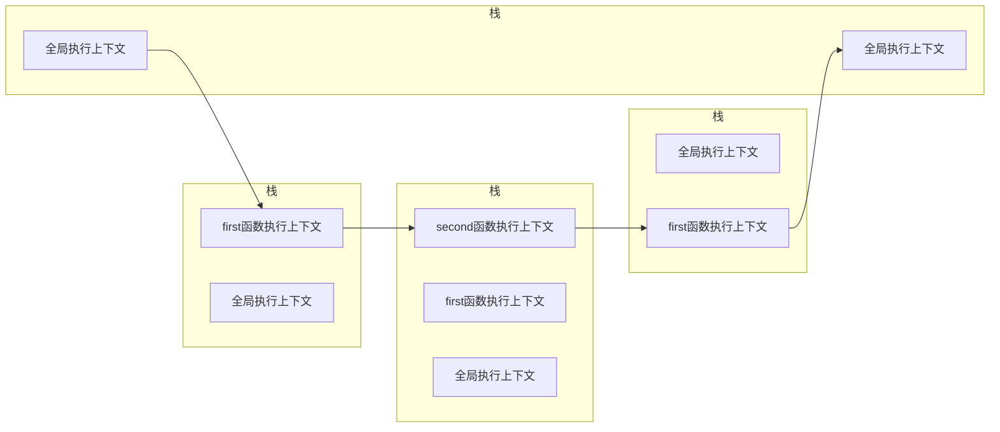

# JavaScript进阶之调用堆栈

## :grey_question:**JavaScript是如何工作的** 

### JavaScript引擎

​	主要由两部分构成：

  + **内存堆：**内存分配
  + **调用栈：**	代码执行

**引擎外诸如web API , 事件循环，回调队列**

#### 调用栈

​	JavaScript是**单线程语言**，只有一个调用栈，同一时间只能做一件事。

​	调用栈是一种后进先出（LIFO）的数据结构，当JavaScript引擎遇到脚本时，首先创建一个**全局执行上下文**，

并压入栈顶，当遇到函数调用时，创建一个**函数执行上下文**并压入栈顶。然后执行栈顶的函数，当函数执行结束，从栈顶弹出**执行上下文**，控制流程来到下一个上下文。直到脚本结束将全局上下文从栈里弹出。

 ~~~javascript
[do sth]

function first(){
    [do sth];
    second();
    [do sth];
}

function second(){
    [do sth];
}

first();

[do sth];
 ~~~

**上述代码调用栈变化情况：**



#### 堆栈溢出

```javascript
function foo(){
    foo();
}
foo();
```

在上述递归函数中，因为没有终止条件，所以会一步一步将foo函数推入调用栈中，直到大于调用栈大小而报错。